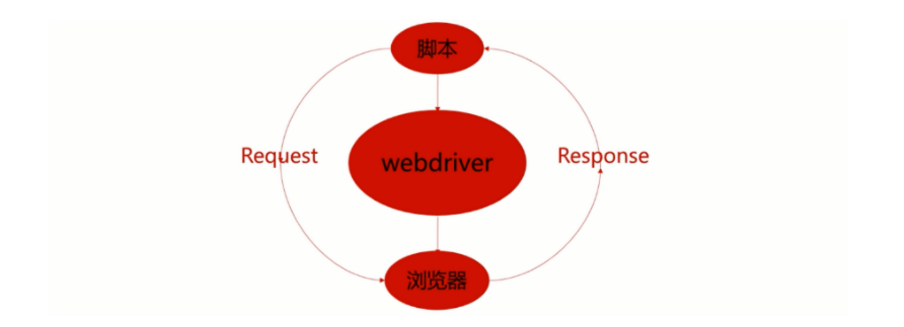
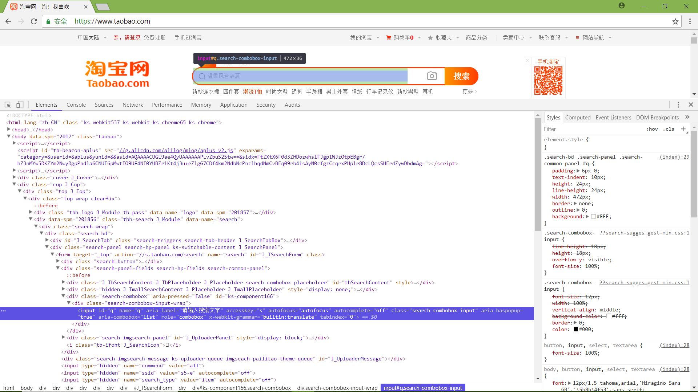
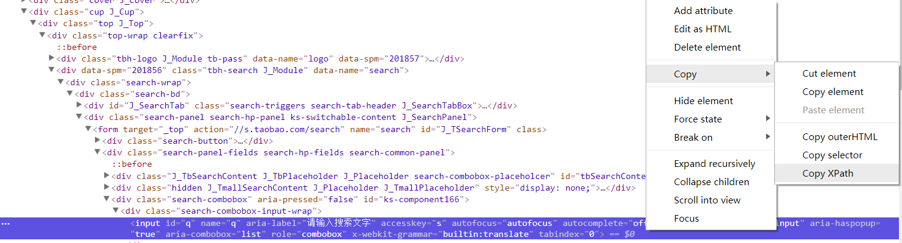
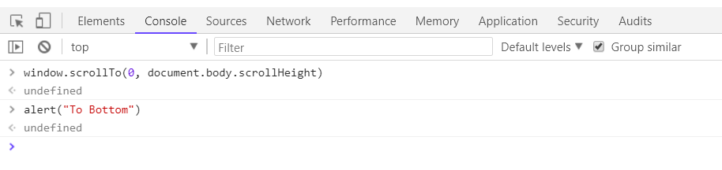

## Selenium Webdriver

### 1. 简介

selenium模拟用户操作浏览器，自动化测试工具。Selenium的核心Selenium Core基于JsUnit，完全由JavaScript编写，因此可以用于任何支持JavaScript的浏览器上。

- Selenium RC——前身
- Selenium IDE —— 录制脚本，导出脚本
- Selenium Webdriver
- Selenium Grid——在不同的主机上运行脚本

**相关浏览器工具**

FireFox浏览器

- FireBug
- FirePath

Chrome

**环境搭建**

pip 安装selenium

python2.7，chrome，chromedriver.exe放到Scripts目录下

### 2. Selenium Webdriver工作原理

​	webdriver启动一个新的线程去启动浏览器，并将浏览器绑定在特定的端口。通过脚本向浏览器发送请求，浏览器处理后将结果返回脚本



```python
>>> from selenium import webdriver
>>> browser = webdriver.Chrome()
DevTools listening on ws://127.0.0.1:12109/devtools/browser/b8b001bf-216b-49b8-a012-054e6da7851c
```

### 3. 浏览器的启动

```python
from selenium import webdriver
browser = webdriver.Chrome()
browser.get("http://www.taobao.com")
```

### 4. 元素的定位

​	自动化测试都是模拟用户操作，所操作的都是页面中的元素，所以首先需要对元素进行定位。Chrome中右键-检查可查看元素



**查找单个元素**

- find_element_by_name
- find_element_by_id
- find_element_by_xpath
- find_element_by_link_text
- find_element_by_partial_link_text
- find_element_by_tag_name
- find_element_by_class_name
- find_element_by_css_selector
- find_element并引入By模块

```python
>>> input_first = browser.find_element_by_id("q")
>>> input_second = browser.find_element_by_css_selector("#q")
>>> input_third = browser.find_element_by_xpath('//*[@id="q"]')
```

Chrome选中元素右键可以copy xpath或css selector



当有很多元素满足条件时，默认选择第一个元素

**查找多个元素**

- find_elements


### 5. Selenium的常见API

#### 5.1 WebDriver

- 打开地址

  ```python
  browser.get()
  browser.navigate.to()
  ```

- 操作浏览器

  ```python
  browser.navigate().refresh()
  browser.navigate().forward()
  browser.navigate().back()
  browser.getTitle()

  browser.getCurrentUrl()
  browser.manager().window().maximize()
  browser.quite()
  browser.close()
  ```


- 执行脚本

  ```python
  # 有些页面元素需要滚动过去才加载
  # 滚动到页面底部并弹提示
  browser.execute_script('window.scrollTo(0, document.body.scrollHeight)')
  browser.execute_script('alert("To Bottom")')
  ```

  Chrome浏览器可以使用console执行JS

  

- 等待

  - 隐式等待：到了一定的时间发现元素还没有加载，则继续等待我们指定的时间，如果超过了我们指定的时间还没有加载就会抛出异常，如果没有需要等待的时候就已经加载完毕就会立即执行

    ```python
    browser.implicitly_wait(10)
    ```

  - 显示等待：指定一个等待条件，并且指定一个最长等待时间，会在这个时间内进行判断是否满足等待条件，如果成立就会立即返回，如果不成立，就会一直等待，直到等待你指定的最长等待时间，如果还是不满足，就会抛出异常，如果满足了就会正常返回

- 其他

  ```python
  >>> from selenium import webdriver
  >>> dir(webdriver.chrome.webdriver.WebDriver)
  ['__class__', '__delattr__', '__dict__', '__doc__', '__format__', '__getattribute__', '__hash__', '__init__', '__module__', '__new__', '__reduce__', '__reduce_ex__', '__repr__', '__setattr__', '__sizeof__', '__str__', '__subclasshook__', '__weakref__', '_unwrap_value', '_web_element_cls', '_wrap_value', 'add_cookie', 'application_cache', 'back', 'close', 'create_options', 'create_web_element', 'current_url', 'current_window_handle', 'delete_all_cookies', 'delete_cookie', 'desired_capabilities', 'execute', 'execute_async_script', 'execute_script', 'file_detector', 'file_detector_context', 'find_element', 'find_element_by_class_name', 'find_element_by_css_selector', 'find_element_by_id', 'find_element_by_link_text', 'find_element_by_name', 'find_element_by_partial_link_text', 'find_element_by_tag_name', 'find_element_by_xpath', 'find_elements', 'find_elements_by_class_name', 'find_elements_by_css_selector', 'find_elements_by_id', 'find_elements_by_link_text', 'find_elements_by_name', 'find_elements_by_partial_link_text', 'find_elements_by_tag_name', 'find_elements_by_xpath', 'forward', 'fullscreen_window', 'get', 'get_cookie', 'get_cookies', 'get_log', 'get_network_conditions', 'get_screenshot_as_base64', 'get_screenshot_as_file', 'get_screenshot_as_png', 'get_window_position', 'get_window_rect', 'get_window_size', 'implicitly_wait', 'launch_app', 'log_types', 'maximize_window', 'minimize_window', 'mobile', 'name', 'orientation', 'page_source', 'quit', 'refresh', 'save_screenshot', 'set_network_conditions', 'set_page_load_timeout', 'set_script_timeout', 'set_window_position', 'set_window_rect', 'set_window_size', 'start_client', 'start_session', 'stop_client', 'switch_to', 'switch_to_active_element', 'switch_to_alert', 'switch_to_default_content', 'switch_to_frame', 'switch_to_window', 'title', 'window_handles']
  ```

#### 5.2 WebElement

- 获取属性

  ```python
  # 获取元素element的class属性
  element.get_attribute('class')
  ```


- 获取文本、id等

  ```python
  element.text
  element.id
  element.location
  element.tag_name
  element.size
  ```


- 输入、清除、点击

  ```python
  from selenium import webdriver
  import time

  browser = webdriver.Chrome()
  browser.get("http://www.taobao.com")
  input_str = browser.find_element_by_id('q')
  # 输入ipad，清除，在输入MacBook pro，点击搜索
  input_str.send_keys("ipad")
  time.sleep(1)
  input_str.clear()
  input_str.send_keys("MacBook pro")
  button = browser.find_element_by_class_name('btn-search')
  button.click()
  ```

- 其他

  ```python
  >>> dir(webdriver.remote.webelement.WebElement)
  ['__class__', '__delattr__', '__dict__', '__doc__', '__eq__', '__format__', '__getattribute__', '__hash__', '__init__', '__module__', '__ne__', '__new__', '__reduce__', '__reduce_ex__', '__repr__', '__setattr__', '__sizeof__', '__str__', '__subclasshook__', '__weakref__', '_execute', '_upload', 'clear', 'click', 'find_element', 'find_element_by_class_name', 'find_element_by_css_selector', 'find_element_by_id', 'find_element_by_link_text', 'find_element_by_name', 'find_element_by_partial_link_text', 'find_element_by_tag_name', 'find_element_by_xpath', 'find_elements', 'find_elements_by_class_name', 'find_elements_by_css_selector', 'find_elements_by_id', 'find_elements_by_link_text', 'find_elements_by_name', 'find_elements_by_partial_link_text', 'find_elements_by_tag_name', 'find_elements_by_xpath', 'get_attribute', 'get_property', 'id', 'is_displayed', 'is_enabled', 'is_selected', 'location', 'location_once_scrolled_into_view', 'parent', 'rect', 'screenshot', 'screenshot_as_base64', 'screenshot_as_png', 'send_keys', 'size', 'submit', 'tag_name', 'text', 'value_of_css_property']
  ```

  ​

## CSS Selector

| 选择器                   | 例子                  | 例子描述                                            |
| ------------------------ | --------------------- | --------------------------------------------------- |
| .*class*                 | .intro                | 选择 class="intro" 的所有元素。                     |
| \#*id*                   | #firstname            | 选择 id="firstname" 的所有元素。                    |
| *                        | *                     | 选择所有元素。                                      |
| *element*                | p                     | 选择所有 <p> 元素。                                 |
| *element*,*element*      | div,p                 | 选择所有 <div> 元素和所有 <p> 元素。                |
| *element* *element*      | div p                 | 选择 <div> 元素内部的所有 <p> 元素。                |
| *element*>*element*      | div>p                 | 选择父元素为 <div> 元素的所有 <p> 元素。            |
| *element*+*element*      | div+p                 | 选择紧接在 <div> 元素之后的所有 <p> 元素。          |
| [*attribute*\]           | [target]              | 选择带有 target 属性所有元素。                      |
| [*attribute*=*value*\]   | [target=_blank]       | 选择 target="_blank" 的所有元素。                   |
| [*attribute*~=*value*\]  | [title~=flower]       | 选择 title 属性包含单词 "flower" 的所有元素。       |
| [*attribute*\|=*value*\] | [lang\|=en]           | 选择 lang 属性值以 "en" 开头的所有元素。            |
| :link                    | a:link                | 选择所有未被访问的链接。                            |
| :visited                 | a:visited             | 选择所有已被访问的链接。                            |
| :active                  | a:active              | 选择活动链接。                                      |
| :hover                   | a:hover               | 选择鼠标指针位于其上的链接。                        |
| :focus                   | input:focus           | 选择获得焦点的 input 元素。                         |
| :first-letter            | p:first-letter        | 选择每个 <p> 元素的首字母。                         |
| :first-line              | p:first-line          | 选择每个 <p> 元素的首行。                           |
| :first-child             | p:first-child         | 选择属于父元素的第一个子元素的每个 <p> 元素。       |
| :before                  | p:before              | 在每个 <p> 元素的内容之前插入内容。                 |
| :after                   | p:after               | 在每个 <p> 元素的内容之后插入内容。                 |
| :lang(*language*)        | p:lang(it)            | 选择带有以 "it" 开头的 lang 属性值的每个 <p> 元素。 |
| *element1*~*element2*    | p~ul                  | 选择前面有 <p> 元素的每个 <ul> 元素。               |
| [*attribute*^=*value*\]  | a[src^="https"]       | 选择其 src 属性值以 "https" 开头的每个 <a> 元素。   |
| [*attribute*$=*value*\]  | a[src$=".pdf"]        | 选择其 src 属性以 ".pdf" 结尾的所有 <a> 元素。      |
| [*attribute**=*value*\]  | a[src*="abc"]         | 选择其 src 属性中包含 "abc" 子串的每个 <a> 元素。   |
| :first-of-type           | p:first-of-type       | 选择属于其父元素的首个 <p> 元素的每个 <p> 元素。    |
| :last-of-type            | p:last-of-type        | 选择属于其父元素的最后 <p> 元素的每个 <p> 元素。    |
| :only-of-type            | p:only-of-type        | 选择属于其父元素唯一的 <p> 元素的每个 <p> 元素。    |
| :only-child              | p:only-child          | 选择属于其父元素的唯一子元素的每个 <p> 元素。       |
| :nth-child(*n*)          | p:nth-child(2)        | 选择属于其父元素的第二个子元素的每个 <p> 元素。     |
| :nth-last-child(*n*)     | p:nth-last-child(2)   | 同上，从最后一个子元素开始计数。                    |
| :nth-of-type(*n*)        | p:nth-of-type(2)      | 选择属于其父元素第二个 <p> 元素的每个 <p> 元素。    |
| :nth-last-of-type(*n*)   | p:nth-last-of-type(2) | 同上，但是从最后一个子元素开始计数。                |
| :last-child              | p:last-child          | 选择属于其父元素最后一个子元素每个 <p> 元素。       |
| :root                    | :root                 | 选择文档的根元素。                                  |
| :empty                   | p:empty               | 选择没有子元素的每个 <p> 元素（包括文本节点）。     |
| :target                  | #news:target          | 选择当前活动的 #news 元素。                         |
| :enabled                 | input:enabled         | 选择每个启用的 <input> 元素。                       |
| :disabled                | input:disabled        | 选择每个禁用的 <input> 元素                         |
| :checked                 | input:checked         | 选择每个被选中的 <input> 元素。                     |
| :not(*selector*)         | :not(p)               | 选择非 <p> 元素的每个元素。                         |
| ::selection              | ::selection           | 选择被用户选取的元素部分。                          |

## XPath

​	XPath 使用路径表达式来选取 XML 文档中的节点或节点集。节点是通过沿着路径 (path) 或者步 (steps) 来选取的。

#### 选取节点

| 表达式   | 描述                                                     |
| -------- | -------------------------------------------------------- |
| nodename | 选取此节点的所有子节点                                   |
| /        | 从根节点选取                                             |
| //       | 从匹配选择的当前节点选择文档中的节点，而不考虑它们的位置 |
| .        | 选取当前节点                                             |
| ..       | 选取当前节点的父节点                                     |
| @        | 选取属性                                                 |

#### 谓语

位于方括号中，用于查找满足特定条件的元素

| 路径表达式                         | 结果                                                         |
| ---------------------------------- | ------------------------------------------------------------ |
| /bookstore/book[1]                 | 选取属于 bookstore 子元素的第一个 book 元素。                |
| /bookstore/book[last()]            | 选取属于 bookstore 子元素的最后一个 book 元素。              |
| /bookstore/book[last()-1]          | 选取属于 bookstore 子元素的倒数第二个 book 元素。            |
| /bookstore/book[position()<3]      | 选取最前面的两个属于 bookstore 元素的子元素的 book 元素。    |
| //title[@lang]                     | 选取所有拥有名为 lang 的属性的 title 元素。                  |
| //title[@lang='eng']               | 选取所有 title 元素，且这些元素拥有值为 eng 的 lang 属性。   |
| /bookstore/book[price>35.00]       | 选取 bookstore 元素的所有 book 元素，且其中的 price 元素的值须大于 35.00。 |
| /bookstore/book[price>35.00]/title | 选取 bookstore 元素中的 book 元素的所有 title 元素，且其中的 price 元素的值须大于 35.00。 |

#### 通配符

使用通配符可用来选取未知的 XML 元素。

| 通配符 | 描述                 |
| ------ | -------------------- |
| *      | 匹配任何元素节点。   |
| @*     | 匹配任何属性节点。   |
| node() | 匹配任何类型的节点。 |

| 路径表达式   | 结果                              |
| ------------ | --------------------------------- |
| /bookstore/* | 选取 bookstore 元素的所有子元素。 |
| //*          | 选取文档中的所有元素。            |
| //title[@*]  | 选取所有带有属性的 title 元素。   |

#### 轴

选取相对于当前节点的节点集

| 轴名称             | 结果                                                     |
| ------------------ | -------------------------------------------------------- |
| ancestor           | 选取当前节点的所有先辈（父、祖父等）。                   |
| ancestor-or-self   | 选取当前节点的所有先辈（父、祖父等）以及当前节点本身。   |
| attribute          | 选取当前节点的所有属性。                                 |
| child              | 选取当前节点的所有子元素。                               |
| descendant         | 选取当前节点的所有后代元素（子、孙等）。                 |
| descendant-or-self | 选取当前节点的所有后代元素（子、孙等）以及当前节点本身。 |
| following          | 选取文档中当前节点的结束标签之后的所有节点。             |
| following-sibling  | 选取当前节点之后的所有兄弟节点                           |
| namespace          | 选取当前节点的所有命名空间节点。                         |
| parent             | 选取当前节点的父节点。                                   |
| preceding          | 选取文档中当前节点的开始标签之前的所有节点。             |
| preceding-sibling  | 选取当前节点之前的所有同级节点。                         |
| self               | 选取当前节点。                                           |

#### 运算符

可返回节点集、字符串、逻辑值以及数字