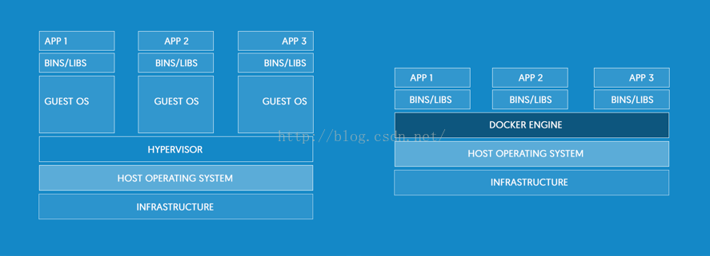
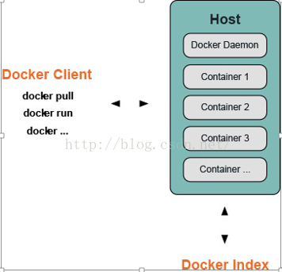
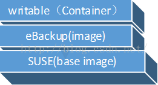
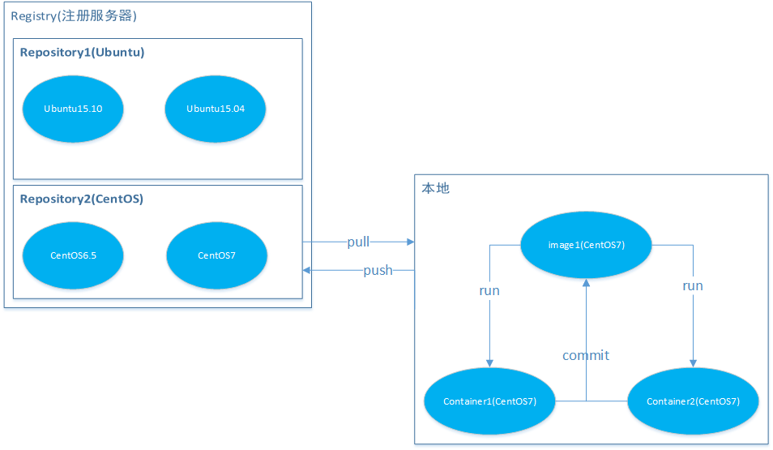

## Docker入门

### 1 什么是Docker？

Docker是基于Go语言实现的云开源项目。Docker的主要目标是“Build，Ship and Run Any App,Anywhere”，也就是通过对应用组件的封装、分发、部署、运行等生命周期的管理，使用户的APP（可以是一个WEB应用或者数据库应用等等）及其运行环境能够做到“一次封装，到处运行”。

Docker引擎的基础是Linux自带的容器（Linux Containers,LXC）技术。IBM对于容器技术的准确描述如下：

容器有效的将单个操作系统管理的资源划分到孤立的组中，以便更好的在孤立的组之间平衡有冲突的资源使用需求。与虚拟化相比，这样既不需要指令级模拟，也不需要即时编译。容器可以在核心CPU本地运行指令，而不需要任何专门的解释机制。此外，也避免了准虚拟化（paravirtualization）和系统调用替换中的复杂性。

我们可以将容器理解为一种沙盒。每个容器内运行一个应用，不同的容器相互隔离，容器之间可以建立通信机制。容器的创建和停止都十分快速（秒级），容器自身对资源的需求十分有限，远比虚拟机本身占用的资源少。

### **2 Docker给DevOps带来的好处**

更快速的交付和部署：开发人员可以使用镜像快速的构建标准开发环境；开发完成后，测试和运维人员可以使用开发人员提供的docker镜像快速部署应用，可以避免开发和测试运维人员之间的环境差异导致的部署问题。

更高校的资源利用：Docker容器的运行不需要额外的虚拟化管理程序支持，它是内核级的虚拟化，在占用更少资源的情况实现更高的性能。

更方便的迁移和扩展：Docker容器几乎可以在任意的平台上运行，包括物理机、虚拟机、公有云、私有云、服务器等。这种兼容使得用户可以在不同的平台之间很方便的完成应用迁移。

更简单的更新管理：使用Dockerfile，只需要小小的配置修改，就可以替代以往大量的更新工作，并且所有修改都以增量方式进行分发和更新。

### **3 虚拟化与1Docker**

****

虚拟化的核心是对资源进行抽象，目标往往是为了在同一个机器上运行多个系统或应用，从而提高系统资源的利用率。虚拟化分为很多类型，比如常见的硬件辅助虚拟化（VMware workstation、 KVM等）。Docker所代表的容器虚拟化技术属于操作系统级虚拟化：内核通过创建多个虚拟的操作系统实例（内核和库）来隔离不同的进程。

传统虚拟化和容器技术结构比较：传统虚拟化技术是在硬件层面实现虚拟化，增加了系统调用链路的环节，有性能损耗；容器虚拟化技术以共享Kernel的方式实现，几乎没有性能损耗。

### **4 Docker怎么实现的？**

Docker是Client/Server的架构，Docker客户端与Docker daemon进行交互，daemon负责构建、运行和发布Docker容器。客户端可以和服务端运行在同一个系统中，也可以连接远程的daemon。Docker的客户端的daemon通过RESTful API进行socket通信。

如上图，Docker守护进程（daemon）在主机上运行，用户不能直接和守护进程打交道，但是可以通过Docker客户端与其进行交互；Client是Docker的初始用户界面，它接收用户的命令并反馈，并且与Docker的守护进行交互。

Docker基于Linux容器技术（LXC），Namespace，Cgroup，UnionFS（联合文件系统）等技术实现：

**namespace（命名空间）**：命名空间是 Linux 内核一个强大的特性。每个容器都有自己单独的命名空间，运行在其中的应用都像是在独立的操作系统中运行一样。命名空间保证了容器之间彼此互不影响。docker实际上一个进程容器，它通过namespace实现了进程和进程所使用的资源的隔离。使不同的进程之间彼此不可见。

Docker用到的一些命名空间有：

pid命名空间：用于隔离进程，容器都有自己独立的进程表和1号进程；

net命名空间：用于管理网络，容器有自己独立的networkinfo；

ipc命名空间：用于访问IPC资源（IPC:InterProcess Communication）；

mnt命名空间：用于管理挂载点，每个容器都有自己唯一的目录挂载；

uts命名空间：用于隔离内核和版本标识（UTS:UnixTimeProcess System），每个容器都有独立的hostname和domain。

**cgroup（控制组）**：是 Linux 内核的一个特性，主要用来对共享资源进行隔离、限制、审计等。只有能控制分配到容器的资源，才能避免当多个容器同时运行时的对系统资源的竞争。控制组技术最早是由 Google 的程序员 2006 年起提出，Linux 内核自 2.6.24 开始支持。控制组可以提供对容器的内存、CPU、磁盘 IO 等资源的限制和审计管理。

**UnionFS（联合文件系统）**：Union文件系统（UnionFS）是一种分层、轻量级并且高性能的文件系统，它支持对 文件系统的修改作为一次提交来一层层的叠加，同时可以将不同目录挂载到同一个虚拟文件系统下(unite several directories into a single virtual filesystem)。Union 文件系统是 Docker 镜像的基础。镜像可以通过分层来进行继承，基于基础镜像（没有父镜像），可以制作各种具体的应用镜像。另外，不同 Docker 容器就可以共享一些基础的文件系统层，同时再加上自己独有的改动层，大大提高了存储的效率。Docker 中使用的 AUFS（AnotherUnionFS）就是一种 Union FS。 AUFS 支持为每一个成员目录（类似 Git 的分支）设定只读（readonly）、读写（readwrite）和写出（whiteout-able）权限, 同时 AUFS 里有一个类似分层的概念, 对只读权限的分支可以逻辑上进行增量地修改(不影响只读部分的)。Docker 目前支持的 Union 文件系统种类包括 AUFS, btrfs, vfs 和 DeviceMapper。

### 5 Docker核心概念

#### 5.1 image

Docker镜像类似于虚拟机镜像，是一个只读模板，并且包含了文件系统。一个镜像可以只包含一个操作系统环境（比如SUSE镜像），也可以安装了用户程序及其运行环境（比如eBackup镜像）。镜像其实就是一个文件，任何用户程序都可以成为镜像的一部分。

镜像=操作系统+软件运行环境+用户程序

如上图，一个layer就是一个image，多个image又可以打包成一个image。Image类似一个单链表系统，每个image包含一个指向parent image的指针，没有parent image的image是baseimage（image的指针靠sqlite数据库来保存）。

最上面的一层（不属于image）是可写的,上面的内容依赖于下面的内容，如果要修改下面的内容，先将下面的内容复制到上面再进行修改。

Image是创建container的基础。

关于image的一些命令：

docker pull     //从网络上下载镜像

docker images  //查看本地主机已经存在的镜像

#### 5.2 Container

容器是从镜像创建的运行实例，可以将其启动、开始。停止、删除，而这些容器都是相互隔离（独立进程），互不可见的。

#### 5.3 Repository

### 6 Docker常用命令

#### 6.1 查看docker信息

1. 查看docker版本 docker version
2. 显示docker系统的信息 docker info

#### 6.2 对image的操作

1. 检索image docker search image_name
2. 下载image docker pull image_name
3. 列出镜像列表 docker images
4. 删除一个或者多个镜像 docker rmi image_name
5. 显示一个镜像的历史 docker history image_name

#### 6.3 启动容器

1. 在容器中运行”echo”命令，输出”helloword” docker run image_name echo "hello word"
2. 交互式进入容器中 docker run -i -t image_name /bin/bash
3. 在容器中安装新的程序 docker run image_name apt-get install -y app_name

#### 6.4 查看容器

1. 列出当前所有正在运行的containerdocker ps
2. 列出所有的containerdocker ps -a
3. 列出最近一次启动的containerdocker ps -l

#### 6.5 保存对容器的修改

1. 保存对容器的修改docker commit ID new_image_name

#### 6.6 对容器的操作

1. 删除所有容器 docker rm docker ps -a -q
2. 删除单个容器 docker rm Name/ID
3. 停止、启动、杀死一个容器 docker stop Name/ID  

​                                                       docker start Name/ID  

​                                                       docker kill Name/ID

4. 从一个容器中取日志 docker logs Name/ID
5. 列出一个容器里面被改变的文件或者目录 docker diff Name/ID
6. 显示一个运行的容器里面的进程信息 docker top Name/ID
7. 从容器里面拷贝文件/目录到本地一个路径 docker cp Name:/container_pathto_path  

​                                                                               docker cp ID:/container_path to_path

8. 重启一个正在运行的容器 docker restart Name/ID
9. 附加到一个运行的容器上面 docker attach ID

#### 6.7 保存和加载镜像

1. 保存镜像到一个tar包 docker save image_name -o file_path
2. 加载一个tar包格式的镜像 docker load -i file_path

#### 6.8  登录registry server

1. 登陆 docker login

#### 6.9 发布image

1. 发布docker镜像 docker push new_image_name